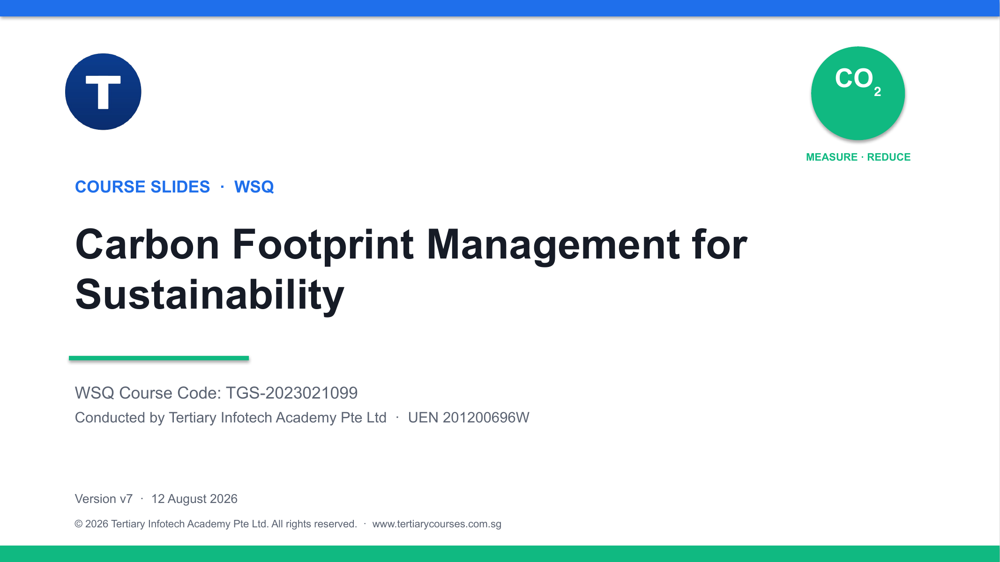

# Carbon Footprint Management for Sustainability

Professional WSQ courseware for **TGS-2023021099**, rebuilt as version **v7** for Tertiary Infotech Academy Pte Ltd.



[Course registration page](https://www.tertiarycourses.com.sg/wsq-carbon-footprint-management-for-sustainability.html) · [Courseware on Google Drive](https://drive.google.com/drive/folders/1GTzvCN0zjUFrn2GOroF5Zsvde5XCmRE7)

## Package

- 133-slide visual trainer deck with concise concepts and no procedural activity steps
- Detailed Learner Guide in DOCX and PDF
- Two-day Lesson Plan mapped to exact v7 slide ranges
- Nine individual real-use-case activity folders with scenario, questions, procedure and CSV data
- Written Assessment: 9 SAQs mapped to K1–K9, 1 hour
- Case Study Assessment: 3 applied questions mapped to A1–A3, 1 hour
- Trainer-only answer keys for both assessment instruments

## Learning outcomes

1. Analyse carbon emission hotspots using recognised standards, boundaries and reliable activity data.
2. Prioritise carbon-footprint reduction initiatives using projections, feasibility, cost-benefit and decision tools.
3. Develop an implementable carbon-footprint reduction plan with governance, targets, monitoring and continual improvement.

## Activity journey

1. Map a multi-site corporate inventory
2. Use the SG Carbon Calculator as an engagement tool
3. Find hotspots in a farm-to-table value chain
4. Model a Singapore fleet transition
5. Screen a smart-factory carbon initiative
6. Prioritise a reduction portfolio with MACC and MCDA
7. Prepare a Singapore MR and carbon-tax readiness plan
8. Design an employee UN ActNow programme
9. Build a board-ready carbon reduction plan

## Repository structure

```text
assessment/        Four current assessment DOCX files
build/             Single-source models and generators
courseware/        PPTX, PDF, Learner Guide and Lesson Plan
activities/        One self-contained folder per activity
reference/         Legacy source artifacts retained locally and excluded from GitHub
SOURCES.md         Evidence register and source-use rules
```

## Build

```bash
python3 build/build_slides.py
python3 build/build_activities.py
python3 build/build_documents.py
python3 build/build_assessment.py
```

Regulatory rates, thresholds, emission factors and formal standards must be verified against current primary sources before external reporting or implementation.
